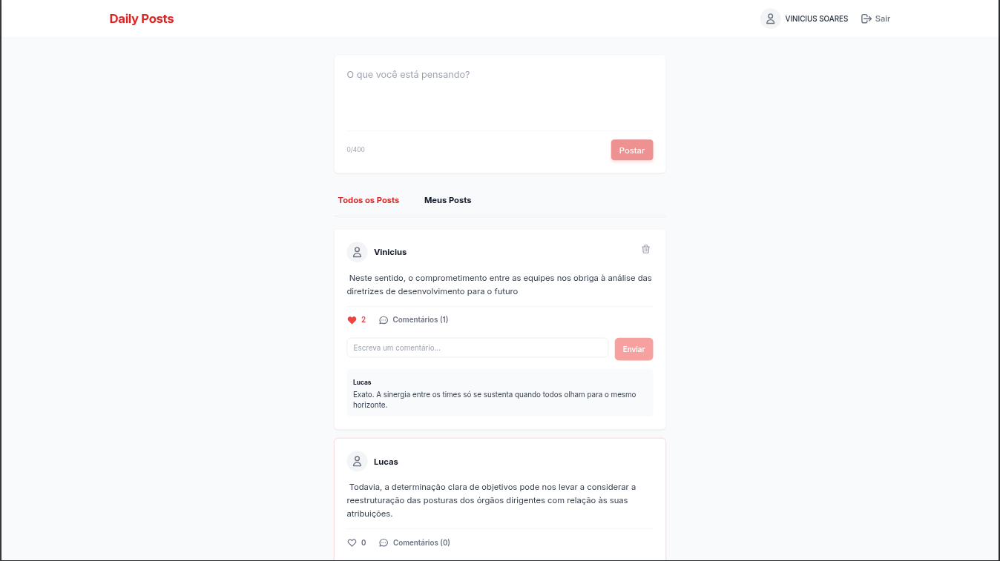
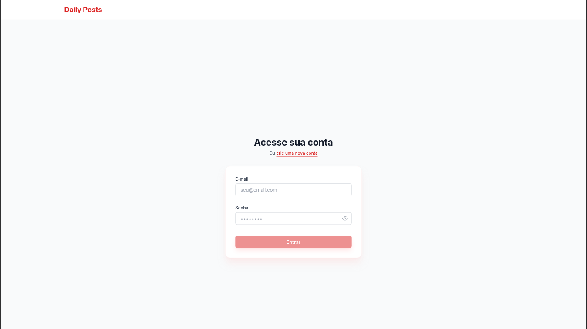
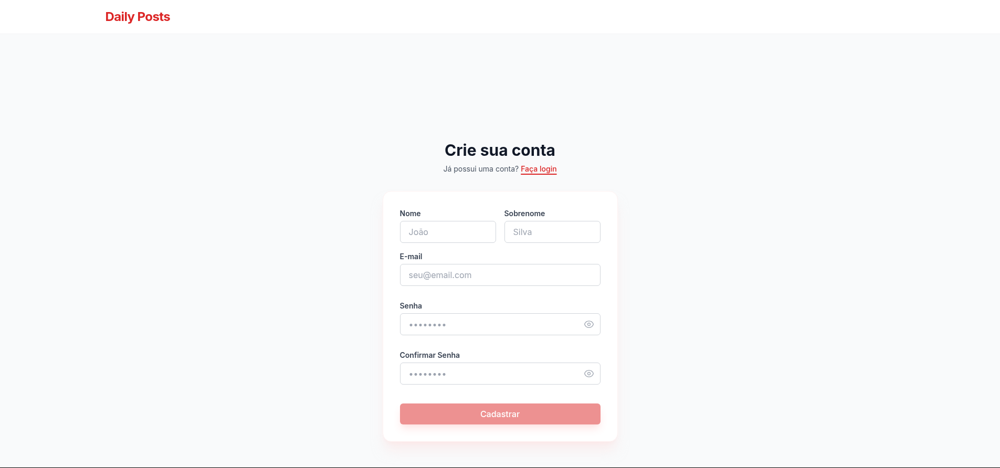

# Daily Posts

O projeto é uma rede social simples de compartilhamento de mensagens diárias, desenvolvida com **Angular** no frontend, utilizando **Tailwind CSS** para uma estilização moderna e responsiva. A aplicação conta com um sistema de autenticação seguro, gerenciamento de posts. No backend, a API foi construída com **Node.js (TypeScript)** e **Express**, utilizando **Prisma** como ORM para comunicação com o banco de dados **PostgreSQL**. A segurança é garantida através de autenticação via **JWT**.

---

### Home 

<p align="center">
   
</p>

### Login e Cadastro 

<p align="center">
  
  
</p>

## ✨ Funcionalidades

- Cadastro e login de usuários com autenticação JWT.
- Criação, listagem e exclusão de posts.
- Sistema de likes com toggle no frontend
- Em **Todos os Posts**, ordenação por quantidade de likes.

---

## 🛠 Tecnologias Utilizadas

### Frontend

- **Angular & TypeScript**: Framework robusto para o desenvolvimento da interface.
- **Tailwind CSS**: Framework CSS utilitário para design ágil e responsivo.
- **Angular Router**: Gerenciamento de rotas e navegação SPA.
- **Reactive Forms**: Manipulação e validação avançada de formulários.
- **RxJS**: Programação reativa para gestão de fluxos de dados.
- **Ngx-toastr**: Biblioteca para notificações visuais elegantes.

### Backend

- **Node.js & TypeScript**: Ambiente de execução seguro com tipagem estática.
- **Express**: Framework minimalista para construção de rotas e middlewares.
- **Prisma**: ORM moderno para modelagem e manipulação de dados.
- **PostgreSQL**: Banco de dados relacional potente e confiável.
- **JWT (JSON Web Token)**: Implementação de autenticação baseada em tokens.
- **BcryptJS**: Criptografia segura para armazenamento de credenciais.

---

## 🚀 Como Rodar o Projeto Localmente

Siga os passos abaixo para configurar o ambiente e executar a aplicação em sua máquina.

### 1. Pré-requisitos

- **Node.js** (Versão LTS recomendada)
- **npm** ou **yarn**
- Uma instância do **PostgreSQL** (Local ou em Cloud como Supabase/Railway)

### 2. Clonar o Repositório

```bash
git clone https://github.com/viniciussoaresbr/daily-posts.git
cd daily-posts
```

### 3. Configuração do Backend

Entre na pasta do backend, instale as dependências e configure as variáveis de ambiente:

```bash
cd backend
npm install
```

Crie um arquivo `.env` na pasta `backend/` com:

```env
DATABASE_URL="sua_string_de_conexão_postgresql"
ACCESS_TOKEN_SECRET="sua_chave_secreta_jwt"
PORT=3001
```

### 4. Configuração do Banco de Dados (Prisma)

Ainda na pasta `backend/`, gere o client do Prisma e sincronize o schema:

```bash
npx prisma generate
npx prisma db push
```

### 5. Configuração do Frontend

Em um novo terminal, entre na pasta do frontend e instale as dependências:

```bash
cd frontend
npm install
```

Verifique o arquivo `frontend/src/environments/environment.dev.ts`:

```ts
export const environment = {
  production: false,
  apiUrl: "http://localhost:3001",
};
```

---

## 🏃 Executando a Aplicação

### Iniciar o Backend

```bash
cd backend
npm run dev
```

O servidor rodará em `http://localhost:3001`.

### Iniciar o Frontend

```bash
cd frontend
npm run start
```

A aplicação abrirá automaticamente em `http://localhost:4200`.

Desenvolvido por [Vinicius Soares](https://github.com/viniciussoaresbr)
